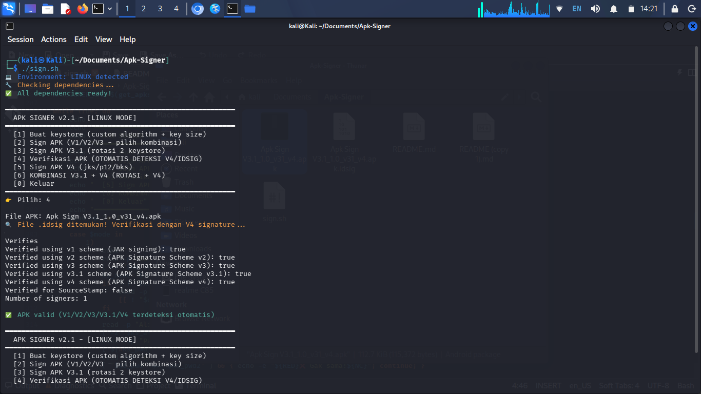

# Apk Signer V2.1
<p align="center">
  
  
  
  
  
</p>

Script Bash interaktif untuk signing APK Android. Support semua versi signature (V1–V4), buat keystore baru, key rotation (V3.1), dan verifikasi APK. Jalan di **Termux** (Android) maupun **Linux**.

---

## ✨ Fitur

| Menu | Fungsi |
|------|--------|
| [1] Buat Keystore | RSA / EC / DSA, pilih ukuran & algoritma |
| [2] Sign APK | V1 / V2 / V3 / V4 (kombinasi bebas, custom pilih per version) |
| [3] Sign V3.1 | Key rotation dengan 2 keystore (custom signature version) |
| [4] Verifikasi APK | Auto-deteksi V4 (.idsig) |
| [5] Sign V4 | Butuh V2 atau V3 aktif |
| [6] V3.1 + V4 | Kombinasi rotasi + V4 sekaligus |

---

## 🔧 Changelog

### v2.1
- **Fix** Menu [2] Sign APK — tambah flag `--v4-signing-enabled` eksplisit supaya V4 gak ikut ke-generate kalau gak dipilih
- **Fix** Menu [3] Sign V3.1 — sebelumnya hardcoded V1+V2+V3=true semua, sekarang pakai `ask_sign_versions` biar bisa custom + tambah flag V4
- **Fix** Echo hasil di menu [3] sekarang tampilin semua versi termasuk V4

### v2.0
- Rilis awal dengan fitur lengkap: buat keystore, sign V1–V4, V3.1 rotation, verifikasi APK
- Support Termux & Linux dengan auto-detect environment
- Auto-install dependencies

---

## 📋 Requirements

- `java` / `keytool` (OpenJDK 17+)
- `apksigner` (Android Build Tools)

> Script otomatis install dependencies kalau belum ada.

---

# 🚀 Cara Pakai

```bash
chmod +x sign.sh
./sign.sh
```

### 📱 Termux (Android)

```bash
pkg install openjdk-17
./sign.sh
```

### 💻 Linux (Debian/Ubuntu)

```bash
sudo apt install default-jdk apksigner -y
./sign.sh
```

---

## ⚠️ Catatan V4

File `.idsig` harus ada **di folder yang sama** dengan APK waktu install.

---

## 📄 License
MIT License — bebas dipakai, dimodif, dan didistribusiin asal tetap kasih kredit.

# Preview

